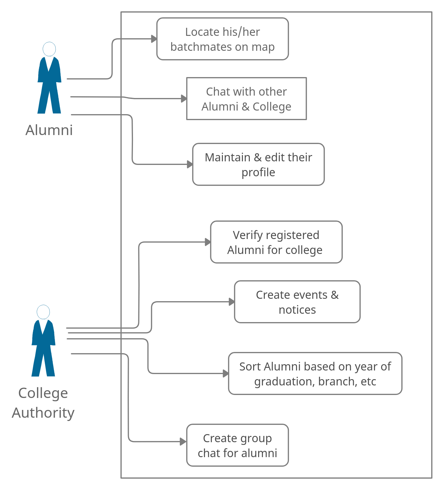
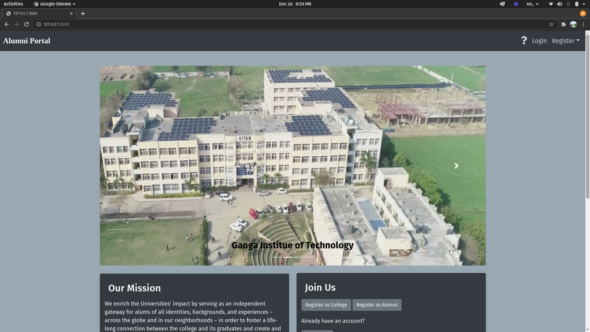
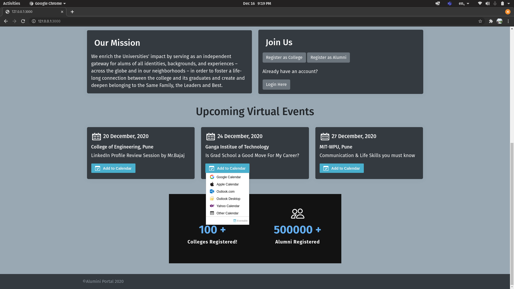
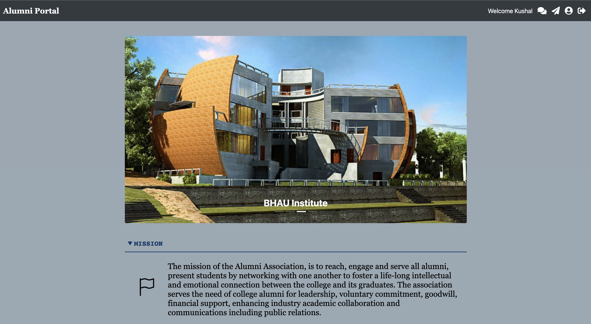
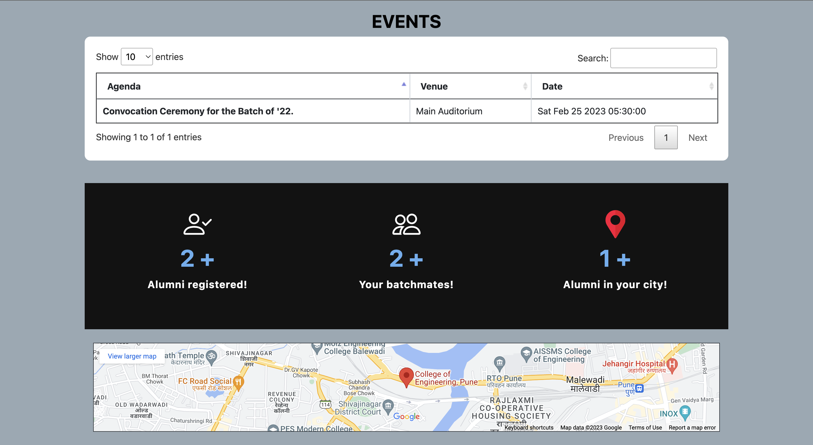
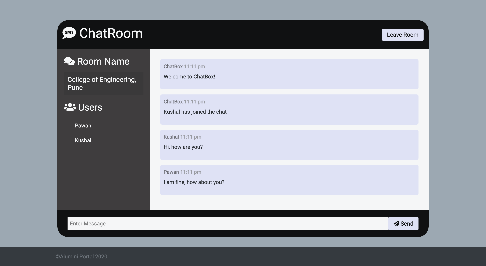
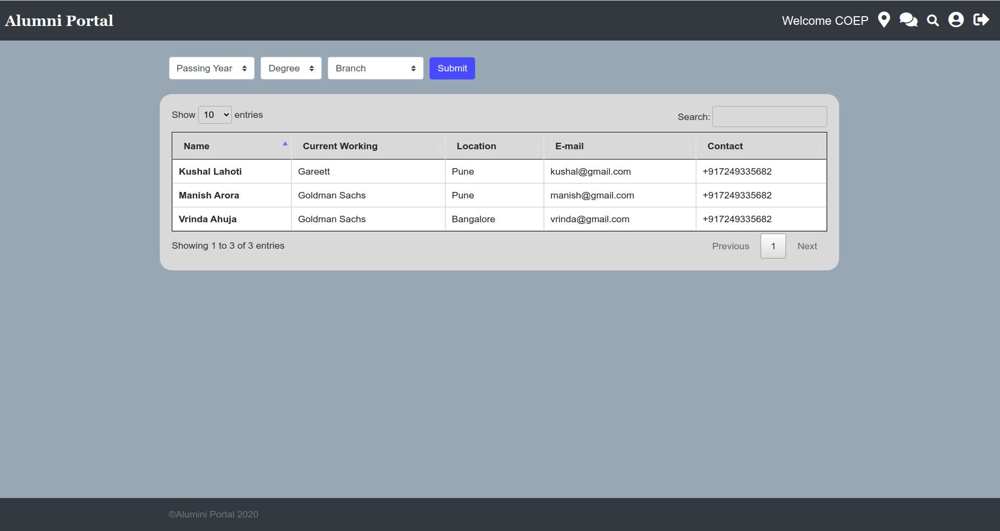

# Alumni Portal

If you find the repository helpful, don’t forget to  ⭐  it!

In the **GITAM Web-A-Thon** hosted by **AppTechTell** on **18-19 December 2020**, me and my team - **THE BUG STOPS HERE** presented this solution. In this competition, our team was the **overall winner**.

## Problem Statement:

-   A large number of students graduate every year and go their own ways
    
-   A lot of times both the passed out students and the college need help from each other
    
-   At times like these, it is very difficult for them to find a platform to interact with each other
    
-   Currently there is no mechanism to facilitate communication between Alumni and Colleges on a broader level
    
-   This makes it difficult to keep track of Alumnus and to verify if the person is Alumnus in times of need

## Proposed Solution:

-   Our Idea is to build a Alumni Portal which can help solve all the problems discussed earlier
    
-   The portal will be available for multiple Colleges and their respective Alumni
    
-   It basically has two user views - College Authority & Alumni
    
-   Security & Authentication features are enabled for both the users in the portal
-   College can register for their account and get features including adding events & notices, verifying the alumnus, creating their groups and searching alumni on some criteria
    
-   Alumnus can register by choosing the college they graduated from and get features like interacting with batchmates & college authorities, attending events, locating their batchmates

## UseCase Diagram:

## Tech Stack:

-   Database:
    -   MongoDB
-   BackEnd:
    -   NodeJS
    -   ExpressJS
-   FrontEnd:
    -   HTML5
    -   JavaScript
    -   CSS
    -   Bootstrap

## How To Run?

-	Firstly, install all the dependencies from package.json using the following command: `npm install`.
-	Login to the MongoDB website create a new database for Alumni Portal there. 
-	Thereafter, follow the steps given in the **.env-format** folder and rename the file as **.env** 
-	Finally, run the following command to tun the server: `npm start`. It will start the server at PORT:3000.
-	Go to http://localhost:3000 to access the application. 

## Application Screenshots:
### Landing Page:  

### Alumni Home Page:

### Chat Room:

### College Alumni List:

